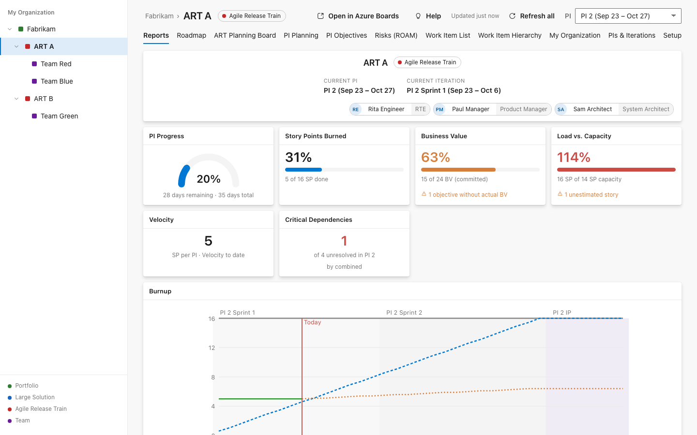
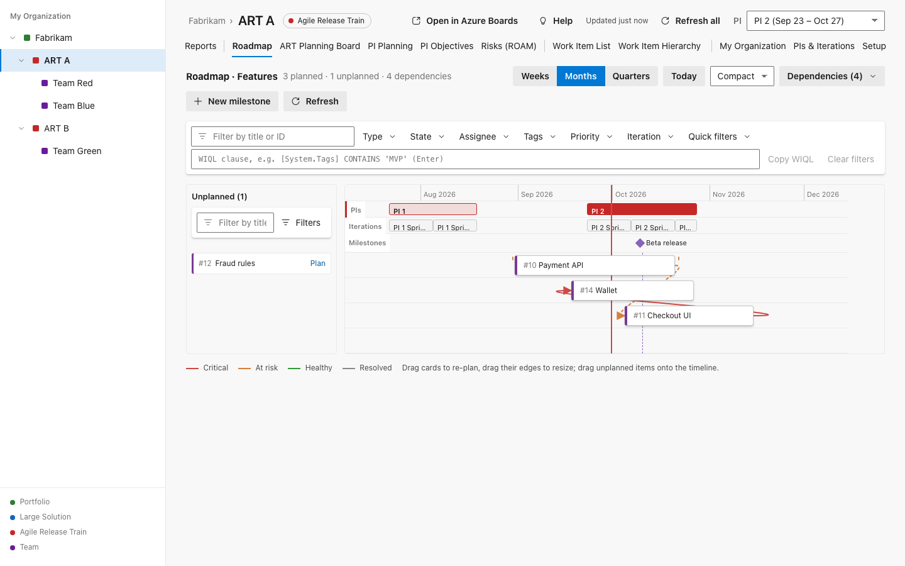
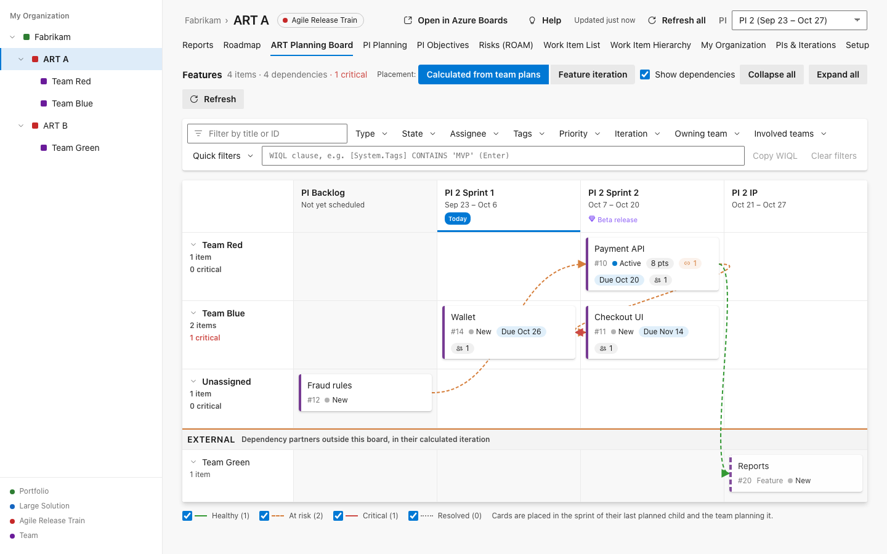
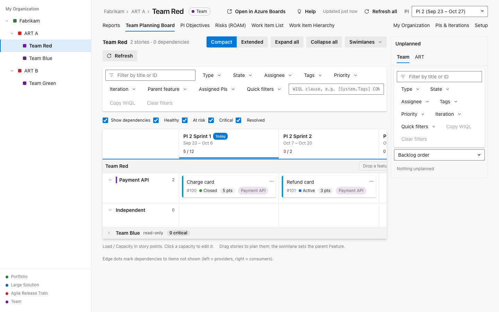
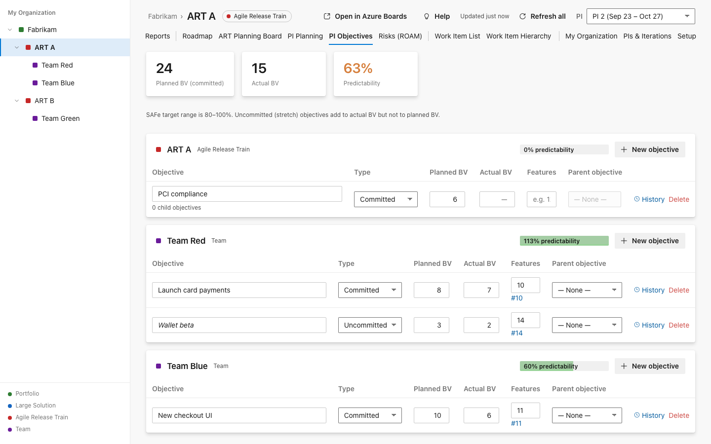
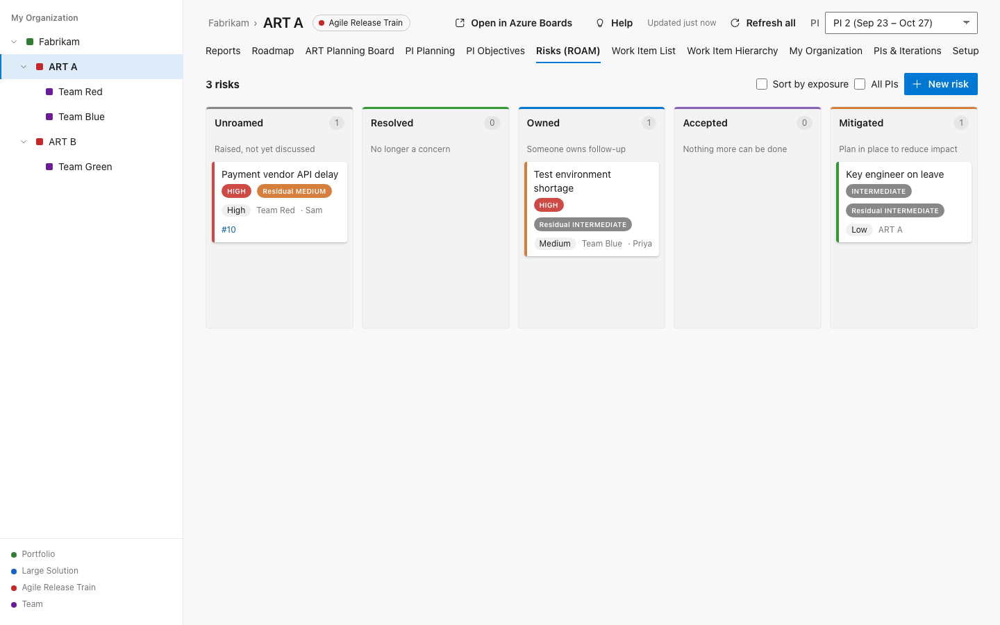
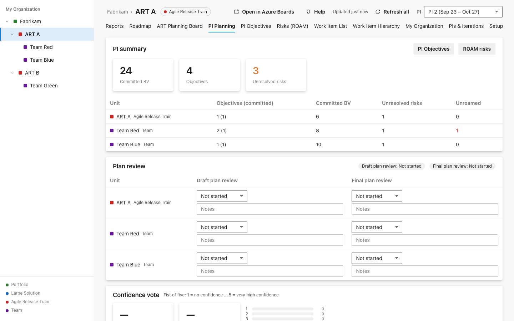

# ScaleLane: scaled agile planning for SAFe® in Azure Boards

**Works on Azure DevOps Server 2022.1 on-premises and on Azure DevOps Services.** ScaleLane adds a
**ScaleLane** hub under **Boards**, so your Agile PMO, Release Train Engineers and Lean Portfolio Management
team can run PI Planning, ART sync and portfolio flow in the Azure DevOps you already use. You don't
need a second tool, a sync connector or a separate licence server.

**Your data stays inside your Azure DevOps.** Plans are ordinary work items, iterations, area paths and
links. Objectives, risks, capacity and votes are kept in your collection's Extension Data Service. The
extension makes no calls outside your Azure DevOps. The only exception is anonymous usage telemetry,
which is off by default and only available to builds that configure an endpoint and where a project
administrator opts in ([privacy statement](https://github.com/eslam-sa3d/safe-ado/blob/main/docs/PRIVACY.md)).

## Who it is for

- **Agile PMO / LACE**: one consistent SAFe structure across every train, without changing your process template.
- **Release Train Engineers**: an ART Planning Board, dependencies, PI objectives, ROAM risks, the confidence vote and Inspect & Adapt in one place.
- **Lean Portfolio Management**: a Portfolio Kanban ranked by WSJF, a roadmap, and epic progress across trains.
- **Teams and Product Owners**: a Team Planning Board with load vs. capacity for PI Planning breakouts.

## Features (version 1.3.0)

The sidebar models **Portfolio → Large Solution → ART → Team**. Each unit maps to an area path and,
optionally, an Azure DevOps team. Every view is scoped to the unit you select.

### Reports
The landing page is a widget dashboard with PI progress, story points burned, business value
(actual vs. planned), load vs. capacity, velocity, critical dependencies, a dependency overview,
a burnup with forecast, milestones, PI objectives, PI risks with exposure, a PI / Epic overview with
WSJF, and an iteration overview. It also shows the **predictability trend** and **flow metrics**
(flow velocity, flow time, flow load and flow distribution). Snapshots keep closed PIs reportable.

### Roadmap
A timeline with PI, iteration and milestone rows. Drag and resize items to plan them. Unplanned
items wait in a sidebar. Dependencies are rated by date (healthy, at risk, critical).

### ART / Solution Planning Board
The program board. Features are placed by their teams' plans. Each row shows involved and owning
teams, warnings about unplanned children, milestones, and critical dependencies. Switch to feature
iteration mode to re-plan by drag and drop.

### Team Planning Board
The PI Planning breakout board: sprint columns, feature swimlanes, load vs. capacity per sprint, Team
and ART backlogs, create in a cell, read-only sibling teams and external dependency lanes.

### Portfolio Kanban with WSJF
Epics by state. Drag an epic to change its state, or sort by WSJF: (Business Value + Time
Criticality + RR/OE) ÷ job size, with the RR/OE field you choose.

### PI Objectives
Committed and uncommitted objectives with planned and actual business value, a parent objective
hierarchy (team → ART → solution), and predictability per unit.

### Risks (ROAM)
A board with Resolved, Owned, Accepted and Mitigated columns. Each risk has probability and impact,
residual values and an exposure matrix, and can link to work items.

### PI Planning event
A PI summary, **draft and final plan reviews** per unit, the **confidence vote** (fist of five)
and **Inspect & Adapt** improvement items.

### Also included
- **Work Item List**: inline editing, SAFe columns (owning team, involved teams, assigned PIs, PI involvement), filters and CSV export.
- **Work Item Hierarchy**: an Epic → Capability → Feature → Story tree with story-point roll-ups.
- **My Organization**: a canvas for building and re-parenting your portfolios, solutions, trains and teams.
- **PIs & Iterations**: create a PI with its sprints and IP iteration in one step and map them to every team.
- **SAFe panel on the work item form**: the item's unit, PI, parent and children, owning team, assigned PIs and planned dates.
- A shared filter bar on every board and list, with a WIQL clause, saved quick filters and Copy WIQL.
- Light, Dark and High-contrast themes that follow Azure DevOps.

ScaleLane works with the Agile, Scrum and CMMI processes and with inherited processes based on them.
The UI respects Azure DevOps permissions, and users without edit rights get a read-only view.

## Getting started

1. **Install.** On Azure DevOps Services, install from this page into your organization. On Azure
   DevOps Server 2022.1, download the VSIX and upload it under *Collection settings → Extensions →
   Browse local extensions → Manage extensions*, then install it into the collection.
2. **Open Boards → ScaleLane → Setup** as a project administrator. The work item types are detected for
   Agile, Scrum and CMMI. Pick the iteration that will hold your PIs.
3. **Build the hierarchy.** Click **Generate from area paths**, or add portfolios, solutions, ARTs
   and teams by hand. Then link your Azure DevOps teams and save.
4. **Create a PI** in **PIs & Iterations**. Its sprints and IP iteration are created and assigned to
   the teams.
5. **Plan.** Teams plan on the Team Planning Board, the RTE follows along on the ART Planning Board,
   and everyone sees the results in Reports.

## Rollout services

ScaleLane is free. If you want help getting a train running, rollout and coaching packages are
available, on-premises or in the cloud: Quick start, PI Planning launch, Portfolio and governance
setup, and a coaching retainer
([services](https://github.com/eslam-sa3d/safe-ado/blob/main/docs/SERVICES.md)).

**Coming from SAFe Ado?** ScaleLane is its new name. Move your data with Export / Import
([migration guide](https://github.com/eslam-sa3d/safe-ado/blob/main/docs/MIGRATION.md)).

## Support

- Questions and bug reports: [GitHub issues](https://github.com/eslam-sa3d/safe-ado/issues)
- How to get help and what to include: [SUPPORT.md](https://github.com/eslam-sa3d/safe-ado/blob/main/SUPPORT.md)
- Reporting a security vulnerability: [SECURITY.md](https://github.com/eslam-sa3d/safe-ado/blob/main/SECURITY.md)
- Privacy and data handling: [docs/PRIVACY.md](https://github.com/eslam-sa3d/safe-ado/blob/main/docs/PRIVACY.md)
- Release notes: [CHANGELOG.md](https://github.com/eslam-sa3d/safe-ado/blob/main/CHANGELOG.md)

---

SAFe® and Scaled Agile Framework® are registered trademarks of Scaled Agile, Inc. This extension is not affiliated with or endorsed by Scaled Agile, Inc.
